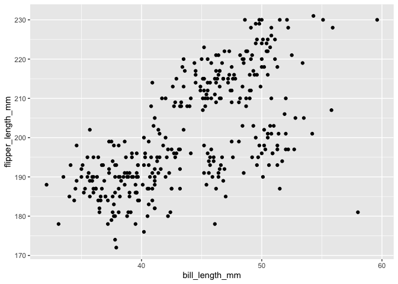

# Get axes limits from a ggplot object


``` r
library(ggplot2)
library(palmerpenguins)
library(patchwork)
```

If you have a `ggplot2` plot object, the extent of the axes is
determined by the data and an extra expansion factor, which depends on
whether the axis is categorical or continuous.

``` r
penguin_plot <- 
  ggplot(data = penguins,
       aes(x = bill_length_mm, y = flipper_length_mm)) +
  geom_point()
print(penguin_plot)
```



To get information about the plot you can use the
`ggplot2::ggplot_build()` function.

``` r
build_obj <- ggplot2::ggplot_build(penguin_plot)
```

The range of the axes can be retrieved from the build object from
`panel_params` inside of the `layout` list. The axes ranges are in
`x.range` and `y.range`

``` r
build_obj$layout$panel_params[[1]]$x.range
```

    [1] 30.725 60.975

``` r
build_obj$layout$panel_params[[1]]$y.range
```

    [1] 169.05 233.95

This allows you to make sure that manually added annotations don’t
artificially extend the axes, for example.

You *could* also calculate these ranges in this case, because you know
the extent of the data and the default expansion parameters.

``` r
x_range = range(penguins$bill_length_mm, na.rm = TRUE)
# ggplot adds 5% to each end of continuous scales by default
expansion_amount = (x_range[2] - x_range[1]) * 0.05
final_range <- c(
  x_range[1] - expansion_amount,
  x_range[2] + expansion_amount
)
final_range
```

    [1] 30.725 60.975

However if the limits change for some other reason, that would not work.
For example, if you add a regression line to a plot, depending on the
data, the plot axes may change.

``` r
# generate some data
set.seed(563)
num_obs <- 10
test_data = tibble::tibble(
  sample = paste0("sample-", seq_len(num_obs)),
  x1 = rnorm(num_obs),
  y1 = rnorm(num_obs),
)

# plot without and with regression line
p1 <- ggplot(data = test_data,
       aes(x = x1, y = y1)) +
  geom_point()

p2 <- ggplot(data = test_data,
       aes(x = x1, y = y1)) +
  geom_point() +
  geom_smooth(method = "lm", formula = y ~ x)

# plot side by side using patchwork to show the difference in the y-axes
p1 + p2
```


Calculating the y-axis range based on the data gives:

``` r
y_range <- range(test_data$y1, na.rm = TRUE)
expansion_amount = (y_range[2] - y_range[1]) * 0.05
final_range <- c(
  y_range[1] - expansion_amount,
  y_range[2] + expansion_amount
)
final_range
```

    [1] -2.2845617  0.9365476

which matches the y-axis on the left hand plot…

``` r
build_obj <- ggplot2::ggplot_build(p1)
build_obj$layout$panel_params[[1]]$y.range
```

    [1] -2.2845617  0.9365476

but not the y-axis for the right hand plot

``` r
build_obj <- ggplot2::ggplot_build(p2)
build_obj$layout$panel_params[[1]]$y.range
```

    [1] -2.357562  1.530510
