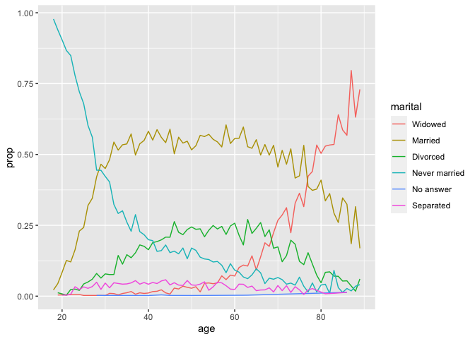
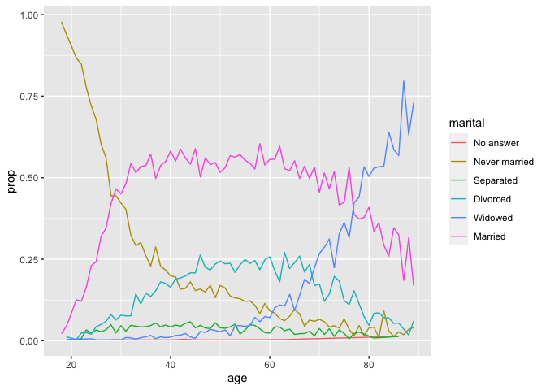

From this
[tweet](https://twitter.com/ChBurkhart/status/1564899291671379972?s=20&t=7xmJtB3u38npiCgYnOXpog).

If you have a line graph, it’s easier for the order of a grouping
variable to be the same as the y-axis value of each group at the end of
the x-axis.  
e.g. 

``` r
library('tidyverse')
by_age <- gss_cat %>%
  filter(!is.na(age)) %>%
  count(age, marital) %>%
  group_by(age) %>%
  mutate(prop = n / sum(n)) %>% 
  ungroup()
```

this:

``` r
by_age %>% 
  mutate(marital = fct_reorder2(marital, age, prop)) %>% 
  ggplot(aes(x = age, y = prop, colour = marital)) +
  geom_line()
```

<!-- -->

looks better than this:

``` r
ggplot(by_age, aes(age, prop, colour = marital)) +
  geom_line(na.rm = TRUE)
```

<!-- -->
