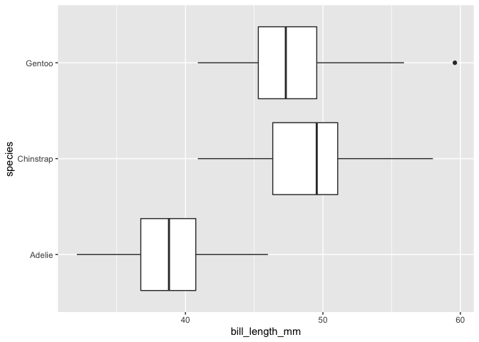
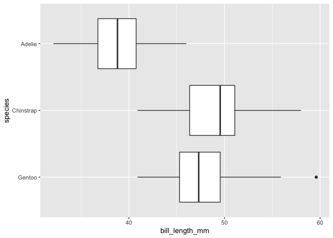

``` r
library('tidyverse')
library('palmerpenguins')
```

``` r
ggplot(penguins, aes(y = species, x = bill_length_mm)) + 
  geom_boxplot()
```

<!-- -->

If you want to reverse the order of categories on a categorical axis
without altering the underlying factor, you can give the `rev` function
to the `limits` argument of `scale_discrete`. For example, you want the
first category at the top of a y-axis rather than the bottom.

``` r
ggplot(penguins, aes(y = species, x = bill_length_mm)) + 
  geom_boxplot() +
  scale_y_discrete(limits = rev)
```

<!-- -->
