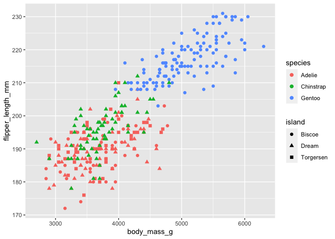
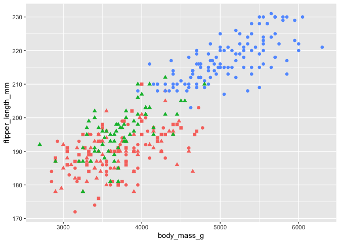
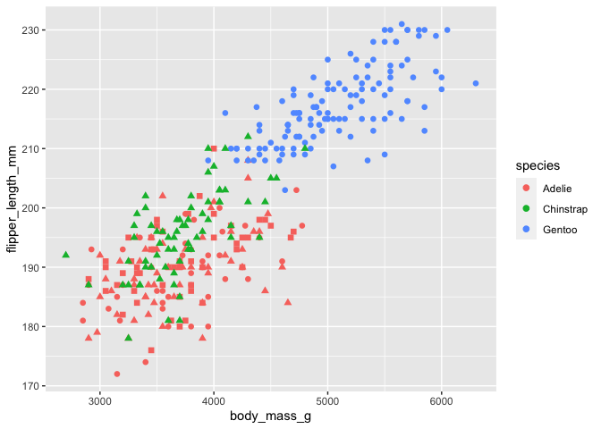

``` r
library('tidyverse')
library('palmerpenguins')
```

If you have 2 aesthetics for a single geom, `ggplot2` will produce a
legend for both of them.  
e.g. 

``` r
ggplot(data = penguins) + 
  geom_point(aes(x = body_mass_g, y = flipper_length_mm, colour = species, shape = island), 
             size = 2)
```



The legend can removed entirely using `show.legend = FALSE` in the call
to `geom_`.

``` r
ggplot(data = penguins) + 
  geom_point(aes(x = body_mass_g, y = flipper_length_mm, colour = species, shape = island), 
             size = 2, show.legend = FALSE)
```



However, if you only want to remove the legend for one aesthetic, you
can use `guide = "none"` in the appropriate `scale_` function.

``` r
ggplot(data = penguins) + 
  geom_point(aes(x = body_mass_g, y = flipper_length_mm, colour = species, shape = island), 
             size = 2) +
  scale_shape_discrete(guide = "none")
```


