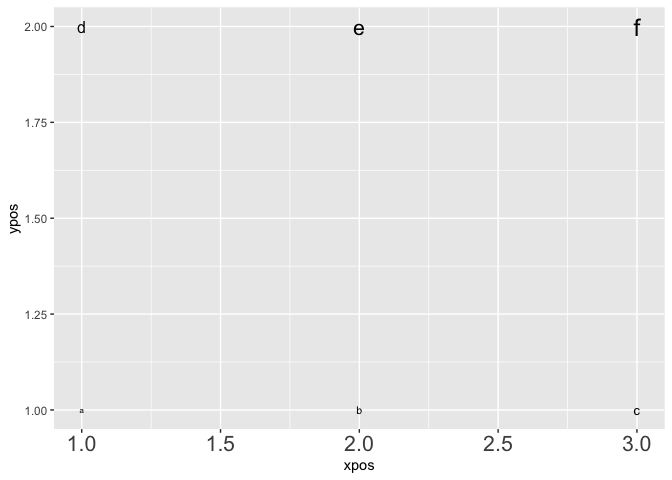

``` r
library('tidyverse')
```

Text sizes within `geom_text` in ggplot2 are done in mm. To convert from
points divide by the `.pt` variable. There are 72 points and 25.4 mm in
an inch. The `.pt` variable represents the number of points per mm = 72
/ 25.4  
Text sizes within `theme` are done in points.

``` r
letters_data <- tibble(
  size_points = c(6, 8, 10, 12, 16, 18),
  letter = letters[1:6],
  xpos = rep(1:3, 2),
  ypos = rep(c(1, 2), each = 3)
)

ggplot(data = letters_data, aes(x = xpos, y = ypos)) +
  geom_text(aes(label = letter), size = letters_data$size_points / .pt) +
  theme(axis.text.x = element_text(size = 16))
```


