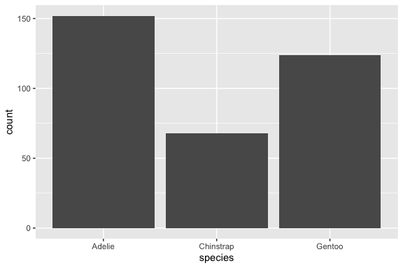
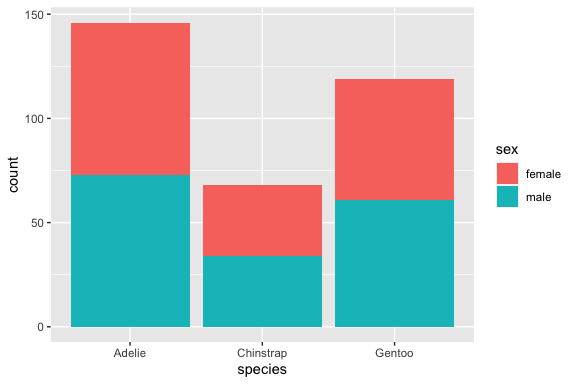
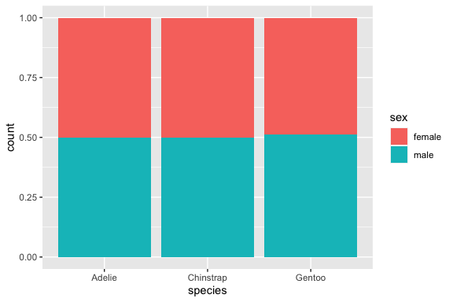
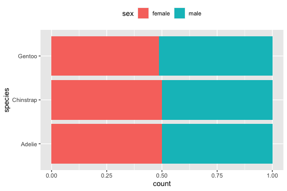

``` r
library(ggplot2)
library(palmerpenguins)
```

Normally `geom_bar` plots the numbers of cases a each `x` position.

``` r
ggplot(penguins, aes(x = species)) + geom_bar()
```



Adding a `fill` or `colour` aesthetic creates a stacked bar chart.

``` r
ggplot(na.omit(penguins), aes(x = species, fill = sex)) + geom_bar()
```



To change it from number of cases to proportion of cases in the group,
add `position = "fill"` to `geom_bar`.

``` r
ggplot(na.omit(penguins), aes(x = species, fill = sex)) + 
  geom_bar(position = "fill")
```



The same thing can be achieved using the `position_fill()` function.
This can be useful for reversing the order of stacking, so that the
legend matches the bars.

``` r
ggplot(na.omit(penguins), aes(x = species, fill = sex)) + 
  geom_bar(position = position_fill(reverse = TRUE)) +
  coord_flip() +
  theme(legend.position = "top")
```


