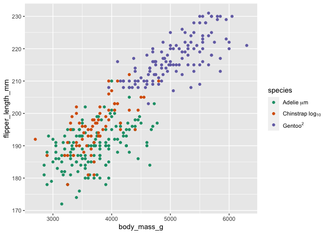

To add text containing symbols to plots, use `expression`.  
Greek letters can be used by including the name of the symbol (For
example alpha, delta, omega etc.)

Use `~` to join symbols with a space.  
Use `*` to join symbols without a space.

For more details type `?plotmath` at the R console.

``` r
ggplot(data = penguins) + 
  geom_point(aes(x = body_mass_g, y = flipper_length_mm, colour = species)) + 
  scale_colour_brewer(type = "qual", palette = "Dark2", 
                      labels = c(expression("Adelie"~mu*"m"), 
                                 expression("Chinstrap"~log[10]), 
                                 expression(Gentoo^2))) + 
  theme(legend.text.align = 0)
```


