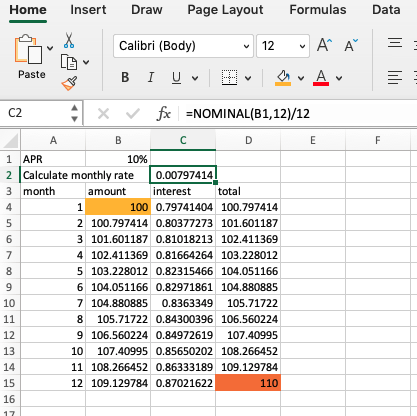

# Calculate a daily/monthly interest rate with compounding from APR

I often want to work out monthly interest based on an APR, but you can't just divide the APR by 12 to get the monthly rate because of compounding.
The NOMINAL function in Excel will do this.
```
NOMINAL function

Description

Returns the nominal annual interest rate, given the effective rate and the number of compounding periods per year.

Syntax

NOMINAL(effect_rate, npery)

The NOMINAL function syntax has the following arguments:

Effect_rate    Required. The effective interest rate.

Npery    Required. The number of compounding periods per year.
```

To be clear this function returns the nominal ANNUAL interest rate, so to get a monthly rate you still need to divide by 12.  
Also, the Effect_rate must be a percentage. So either 10% or 0.1  
e.g.  
For the monthly rate that compounds to an APR of 10%
```
=NOMINAL(10%,12)/12
```

<!-- -->

